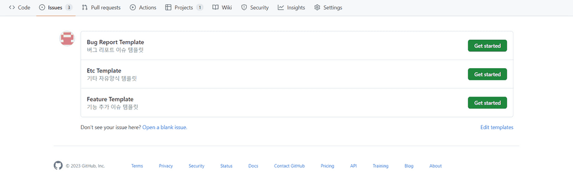
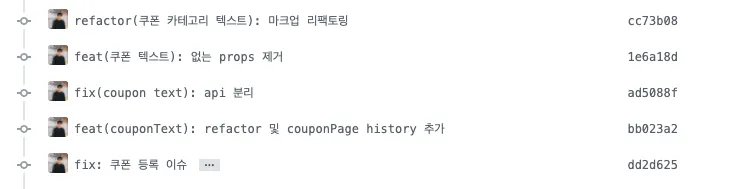

## Tech Stack

| 구분                       | 사용 기술        |
| -------------------------- | ---------------- |
| Node version               | 20.9.0           |
| 언어                       | TypeScript       |
| 코어                       | Nextjs           |
| 스타일링                   | Tailwind         |
| 서버데이터 관리            | React-query      |
| 클라이언트 상태 관리       | Recoil           |
| 패키지 관리 매니저         | Npm              |
| CI/CD                      | Vercel           |
| 번들러                     | create-next-app  |
| 라우팅                     | React-router-dom |
| HTTP client library        | Axios            |
| 테스트 프레임워크          | Jest             |
| 컴포넌트 테스트 라이브러리 | Storybook        |
| 오류 체크                  | sentry           |

#폴더구조


# GitHub 이슈 작성
## 개요
- 이슈를 작성할 때 다음과 같이 템플릿 선택을 통해 빠르게 이슈를 확인하기 위함
- `ISSUE`탭에서 이슈 생성시 다음과 같이 어떤 템플릿을 필요로 하는지 선택할 수 있다.


## Github 이슈와 commit 연결
- 이슈에 올라온 버그 또는 기능을 수정하였을때에 Commit Message에 적절한 키워드를 사용하게되면 이슈를 같이 Close 할 수 있어 굳이 이슈에 들어가 Close 상태로 전환하지 않아도 되어 편리합니다.
<br>
> #### keyword
> - close<br>
> - closes<br>
> - closed<br>
> - fix<br>
> - fixes<br>
> - fixed<br>
> - resolve<br>
> - resolves<br>
> - resolved<br>

### 예시
#### 이슈에 커밋 자동 등록
`#2 - API 명세서 자동화 세팅`

#### 이슈에 커밋 자동 등록 + 이슈 닫기
`fix #2 - 버그를 수정하였습니다.`


<details>
<summary>이슈 템플릿</summary>

### 기능요청 이슈
```
## 어떤 기능인가요?

> 추가하려는 기능에 대해 간결하게 설명해주세요

## 작업 상세 내용

- [ ] TODO
- [ ] TODO
- [ ] TODO

## 참고할만한 자료(선택)
```
### 버그리포트 이슈
```
## 어떤 버그인가요?

> 어떤 버그인지 간결하게 설명해주세요

## 어떤 상황에서 발생한 버그인가요?

> (가능하면) Given-When-Then 형식으로 서술해주세요

## 예상 결과

> 예상했던 정상적인 결과가 어떤 것이었는지 설명해주세요

## 참고할만한 자료(선택)
```


</details>


# 코드리뷰
## 개요
**나만 알아볼 수 있는 코드는 좋은 코드가 아니다.**


1. **Commit Message Rule은 다음을 따른다.**<br>
`type(scope) : description`
    ### 예시
    
2. **Lint 자동화를 맞춘다**
    - 협의 필요함
    - Lint 부분 수정시 Commit내역을 다르게 적용할 필요가..?
        - lint : `lint : 자동수정`
        - non-lint :`type(scope) : description`
3. html은 기능(동작)없이 구조(모양, 형태)만 설계
4. 기능 및 로직은 JS
5. css모듈이 중복되는 경우 모듈화해서 전역처리
6. 정적 분석에 걸리는 실수는 Tool 적극활용
    - ES lint / Prettier 등
    - Pre-commit hook(?) 등록
7. `var` 사용 금지
    - 최초 선언시 `const` 이후 변경이 필요한 경우 `let`사용
8. String 합칠경우 백틱(``)사용
9. for문 forEach 사용
10. DOM에 영향을 주는 컴포넌트는 함수화
11. 선언부와 호출부 분리
    - 호이스팅 방지
    - `const`, `let`은 호이스팅 안하므로 가독성에서 유리
12. 함수 선언식이 아닌 표현식 사용
13. DOM element 객체는 변수로 언선아는게 좋다.
